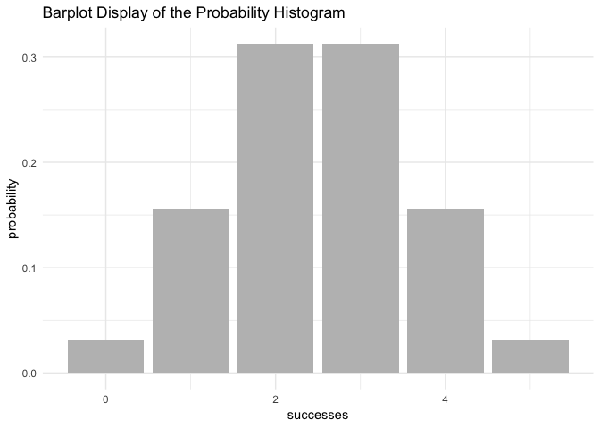
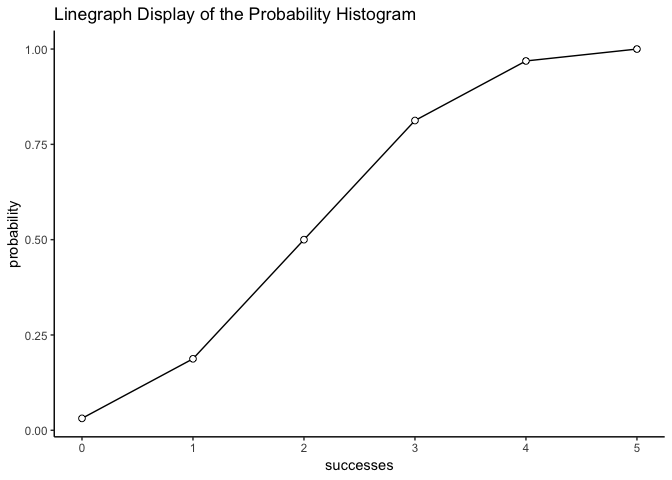

Workout03 Binomial Distribution
================

#### `"Workout03Binomial"` Package:

#### Overview

`"Workout03Binomial"` is a minimal [R](http://www.r-project.org/) package that provides functions for calculationg probabilities of a Binomial random variable and related calculation.

-   `bin_choose` calculates the number of combinations in which *k* successes can occur in *n* trials
-   `bin_probability` calculates the probability of getting *success* in *trials* assuming that the probability of success is *prob*.
-   `bin_distribution` creates a data frame with the probaility distribution with *success* in the first column, and *probability* in the second column.
    -   `plot.bindis` plots the Binomial Distribution with the function plot()
-   `bin_cumulative` creates a data frame with the probaility distribution with *success* in the first column, and *probability* in the second column, and cumlative probability in the third column.
    -   `plot.bincum` plots the Binomial variable with the function plot()
-   `bin_variable` prints out the binomial variable`*`summary.binvar\` constructs the summary of the binomial variable by using this function.
-   *Fuctions of measures:*

<table>
<colgroup>
<col width="25%" />
<col width="39%" />
<col width="35%" />
</colgroup>
<thead>
<tr class="header">
<th>Measures:</th>
<th>Functions to Use:</th>
<th>Description:</th>
</tr>
</thead>
<tbody>
<tr class="odd">
<td>mean</td>
<td>bin_mean(trials,prob)</td>
<td>expected value/mean of binomial distribution</td>
</tr>
<tr class="even">
<td>variance</td>
<td>bin_variance(trials,prob)</td>
<td>variance of a binomial distribution</td>
</tr>
<tr class="odd">
<td>mode</td>
<td>bin_mode(trials,prob)</td>
<td>most likely number of successes</td>
</tr>
<tr class="even">
<td>skewness</td>
<td>bin_skewness(trials,prob)</td>
<td>measures degree of asymmetry of probability distribution</td>
</tr>
<tr class="odd">
<td>kurtosis</td>
<td>bin_kurtosis(trials,prob)</td>
<td>measures tailedness of the probability distribution</td>
</tr>
</tbody>
</table>

#### Motivation

This package has been developed to illustrate the probability distribution among discrete random variables through visualization and calculations. The various functions within the package utilize the ability to calculate measurement summaries.

#### Installation

Install the development version from GitHub via the package `"devtools"`:

``` r
# development version from GitHub:
#install.packages("devtools") 
# install "cointoss" (without vignettes)
devtools::install_github("madisontagg/Workout03Binomial")
# install "cointoss" (with vignettes)
devtools::install_github("madisontagg/Workout03Binomial", build_vignettes = TRUE)
```

#### Usage

``` r
library(Workout03Binomial)

#bin_choose constructs the number of combinations of successes in n trials
bin_choose(n = 5, k = 2)
#> [1] 10

#bin_probability constructs probability of k successes in n trials
bin_probability(success = 2, trials = 5, prob = 0.5)
#> [1] 0.3125

#bin_distribution constructs binomial probability distribution along with the visualization
dis1 <- bin_distribution(trials = 5, prob = 0.5)
print(dis1)
#>   success probability
#> 1       0     0.03125
#> 2       1     0.15625
#> 3       2     0.31250
#> 4       3     0.31250
#> 5       4     0.15625
#> 6       5     0.03125
plot(dis1)
```



``` r

#bin_cumulative constructs the cumulative probabilities of the binomial distribution along with the visualization
dis2 <- bin_cumulative(trials = 5, prob = 0.5)
print(dis2)
#>   success probability cumulative
#> 1       0     0.03125    0.03125
#> 2       1     0.15625    0.18750
#> 3       2     0.31250    0.50000
#> 4       3     0.31250    0.81250
#> 5       4     0.15625    0.96875
#> 6       5     0.03125    1.00000
plot(dis2)
```



``` r

#bin_variable constructs the description of the probability distributions' parametes along with the summary
bin1 <- bin_variable(trials = 10, p = 0.3)
print(bin1)
#> [1] "Binomial variable"
#> [1]  
#> [1] Paramaters
#> [1] - number of trials: 10
#> [1] - prob of success : 0.3
binsum1 <- summary(bin1)
binsum1
#> [1] "Summary Binomial"
#> [1]  
#> [1] Paramaters
#> [1] - number of trials: 10
#> [1] - prob of success : 0.3
#> [1]  
#> [1] Measures
#> [1] - mean    : 3
#> [1] - variance: 2.1
#> [1] - mode    : 3
#> [1] - skewness: 0.276026223736942
#> [1] - kurtosis: -0.123809523809524
```
